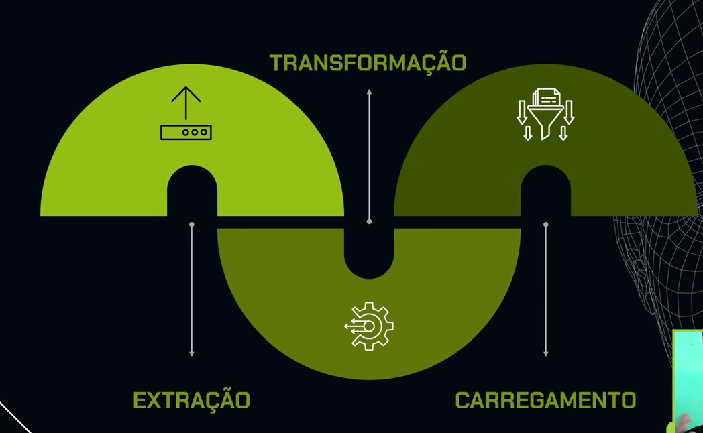

# **Pipeline** de dados 📁💾

O projeto combina os arquivos da empresa **A** com os da empresa **B** e disponibilizar esse arquivo unido para a equipe de análise. Mas não apenas isso, é necessário fornecer uma solução que seja reproduzível para os meses seguintes.

Para tanto, é criado uma **pipeline** de dados que unam esses dados. As etapas da pipilene consiste em extrair, transformar e carregar os dados, como ilustrado na imagem abaixo.

<div align="center">
  
  <br>
  <em>Figura 1: Etapas do pipeline de dados</em>
</div>

## Tecnologias 🔧
<div align="center">


</div>

A linguagem utilizada é python, onde as bibliotecas utilizadas são:
- json
- csv


## Estrutura do Projeto 📂

É ideializado que a construção do pipeline seja reutilizável em outros processos da empresa. Assim, a estrutura de trabalho é definida em: 
1. Utilizar os conceitos do processo de ETL e construir um pipeline de dados com Python;
2. Utilizar python para gerar os [scripts](/src/pipelinedata/) e o [Jupter Notebook](/src/pipelinedata/testes.ipynb) para realização de testes e manipulações de dados;
3. Estruturar os códigos Python em funções. Bem como, as pastas que devem obedecer às diretrizes de um bom desenvolvimento e engenharia de software
    ````
    | pipeline-data/
    |--docs/: Contém os documentos e referências
    |--src/: Contém todo o código fonte do projeto.
    |----data/: Contém as bases de dados
    |--------raw/: Dados brutos
    |--------ready-processed/: Dados processados
    |----pipelinedata/: Contém os códigos fontes
    ````
3. Criação de um ambiente virtual Python
4. Reconheça os benefícios de criar um pipeline reutilizável

## Referências 
1. [Igor Nascimento Alves](https://cursos.alura.com.br/user/igor-nascimento-flipe)
2. [Pipeline de dados](https://cursos.alura.com.br/course/pipeline-dados-combinando-python-orientacao-objeto)